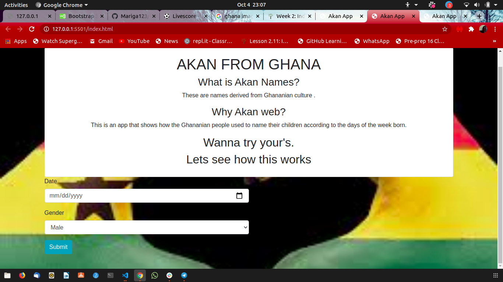
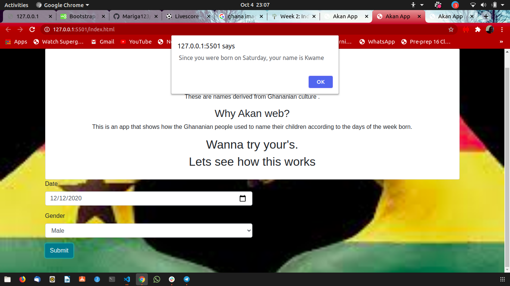

# AKAN APP
#### Author 
 MARIGA JOHN
## Description
* A naming system practiced in Ghana while naming their children according to the day of the week born.
## Demo

This is the landing page of before you fill in the data to get a name of your birth date.

This is the response given you get after filling the details required to check your Akan name.

## To run my page on your browser,
* Download the zip codes from my git account.
* Extract the zip file to your folder directory documents or desktop.
* Open the folder saved using Visual studio or Atom.
* To render the page on your browser,Go live with your server.
* Edit codes and push it to github
## Known Bugs
* still working on on the errors brought when runnning codes in javascript and how to define them.
## Behaviour-Driven Development
* This app intends to teach people on the culture of people of Ghana and how they used to name their children.
* The user while interacting with this app expects an output of the names according to the days of the week and year born.
* The user can also test using his own birth date and see if he/she was in Ghana how he will be named.
## Technologies Used
* HTML
* CSS
* javascript
## Support and contact details
* email @ johnmariga8@gmail.com
* 0742249975
* fb @zellyjones
* instagram @ Mariga john
### License
licensed under [MIT license](LICENSE)